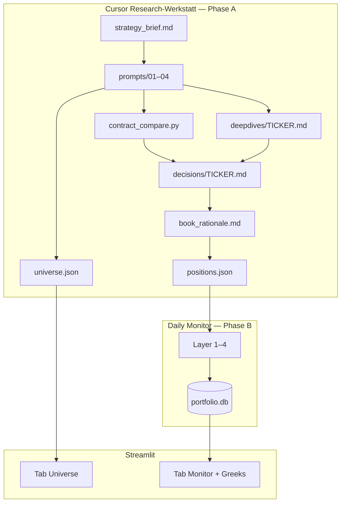

<!-- Reality Block
last_update: 2026-06-24
status: draft
scope:
  summary: "Phase A Research — Cursor-Werkstatt, Artefakte, Trennung Monitor."
  in_scope:
    - full phase A stages A.1–A.4
    - cursor workshop
    - data flow
  out_of_scope:
    - layer 1-4 implementation
notes:
  - "Claude Portfolio.pdf = UX-Referenz; Inhalt aus Cursor-Sessions"
-->

# Research-Workflow & Gesamtaufbau

> **Claude Portfolio.pdf** = Struktur-Blueprint (welche Analyse-Schritte, welche Felder).  
> **Cursor** = Research-Werkstatt (Chat + Agent + Scripts).  
> **Python Layer 1–4** = Daily Monitor (nur Book).

---

## Gesamtarchitektur



---

## Phase A — alle Stufen (PDF-Mapping)

| Stufe | PDF (Video / Screens) | Tool | Output |
|-------|------------------------|------|--------|
| **A.1** Strategie | „Strategy Research“ — LEAPs + Shares, Constraints | Cursor S0 | `strategy_brief.md` |
| **A.2** Ticker finden | „Screening Names“ — breiter Screen aus Strategie | Cursor S1 | `universe.json` |
| **A.2a** Scoring | Katalysator, IV, Korrelation, These | Cursor S1 | universe + Status |
| **A.2b** Deep Dive | Nokia Segmente, P/S, Projektion | Cursor S2 | `deepdives/TICKER.md` |
| **A.2c** Portfolio-Fit | Sektor-Mix, Katalysator-Fenster | Cursor S4 | `book_rationale.md` |
| **A.3** Contract Pick | „Choosing Contracts“, Strike-Vergleich | Cursor S3 + Script | `decisions/*.md` |
| **A.4** Book | Trades in Broker | Cursor S4 | `positions.json` |
| **—** Monitor | „Options Terminal“, Layer 1–4 | **Phase B** | `portfolio.db` |

Detail Ticker-Discovery: [`reference/screening_methodology.md`](../reference/screening_methodology.md)

**Taktung & Automatisierung:** [`reference/research_cadence.md`](../reference/research_cadence.md)

---

## Cursor vs. Claude Web vs. „nur Code“

| Schicht | Rolle | Warum |
|---------|-------|-------|
| **Cursor Chat/Agent** | Qualitative Analyse, Text, Entscheidungen | Ersetzt Claude-Web-Dialog; schreibt direkt ins Repo |
| **Markdown + JSON** | Persistente Research-Artefakte | Besser als Chat-Verlauf; versionierbar |
| **`contract_compare.py`** | Live Chain + Greeks-Tabelle | Ersetzt JSX „Robinhood Data“-Panel |
| **Streamlit Universe-Tab** | Kurzübersicht der Liste | Nur **Lesen** — kein Denk-UI nötig |

**Wir bauen die JSX-Panels nicht 1:1 nach** — Inhalt landet in Dateien, Zahlen kommen aus Scripts.  
Das **ist** die Werkstatt, nur repo-native statt Browser-Artifact.

Playbook: [`cursor/research_workshop.md`](../cursor/research_workshop.md)

---

## Artefakte

| Datei | Stufe | Inhalt |
|-------|-------|--------|
| `reference/strategy_brief.md` | A.1 | Constraints, Vehicle-Regeln |
| `reference/screen_YYYY-MM.md` | A.2 | Optional: Session-Rohprotokoll |
| `research/universe.json` | A.2+ | Alle Namen, Status, Kurzthese |
| `research/deepdives/TICKER.md` | A.2b | Segmente, Growth-Math, Bewertung |
| `research/decisions/TICKER_….md` | A.3 | Strike-Entscheidung + Begründung |
| `research/book_rationale.md` | A.4 | Correlation, Vehicle Lesson |
| `positions.json` | A.4 | Nur gehaltene Positionen |
| `data/portfolio.db` | Phase B | Daily Runs — **nicht** Research |

---

## Universe — Lifecycle

```text
researched → watchlist → in_book → passed | rejected | traded | mentioned
```

| Status | positions.json? |
|--------|-----------------|
| `in_book` | **Ja** |
| alle anderen | Nein |

Schema: [`research_universe_schema.md`](research_universe_schema.md)

---

## Session-Ablauf in Cursor

1. Prompt-Vorlage öffnen: `code/options-book/research/prompts/0x_….md`
2. `@strategy_brief.md` + relevante Dateien referenzieren
3. Agent schreibt Outputs (Regel: `.cursor/rules/options-book-research.mdc`)
4. Bei S3: `python scripts/contract_compare.py …` ausführen lassen
5. Bei `in_book`: Broker-Trade → `sync_positions.py` → `run.py`

---

## Monitor-Tabs (Phase B)

| Tab | Quelle | Phase |
|-----|--------|-------|
| Monitor | DB + positions.json | B |
| Greeks | DB | B |
| Universe | universe.json (+ yfinance Anreicherung) | A-Anzeige |

---

## Wann Live-Daten? (IBKR / yfinance)

| Schritt | Art | Datenquelle |
|---------|-----|-------------|
| S1 Screen | Qualitativ — Namen + These | Keine Pflicht-Preise |
| S2 Deep Dive | Qualitativ — Segmente, Bewertung | Optional Spot |
| **S3 Contract** | **Quantitativ — was kostet es jetzt?** | **IBKR Chain** · `contract_compare.py` (yfinance) |
| Daily Monitor | Marks, Greeks, Alerts | yfinance (MVP) |

Strike/Expiry **erst in S3** mit echter Chain entscheiden — nicht beim Screen erfinden.

---

## Nächste Schritte

1. ~~`strategy_brief.md`~~ ✅ (Standard €10K EUR + Micro)
2. ~~**S1 Broad Screen**~~ ✅ 2026-06-23 → `universe.json` (18 Kandidaten)
3. ~~**S2:** NOK · MP · NOW · FTNT~~ ✅
4. S3 pending: NOW ($110C) · FTNT (13 Sh) — NOK/MP Hold
5. Paper sync → Monitor

Siehe: [`reference/screen_2026-06.md`](../reference/screen_2026-06.md) · [`reference/research_cadence.md`](../reference/research_cadence.md)
