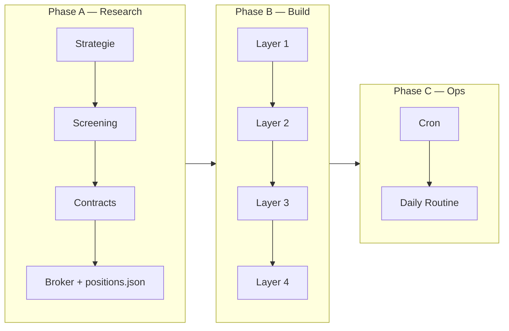

<!-- Reality Block
last_update: 2026-06-23
status: draft
scope:
  summary: "Master-Plan: Phasen A–C, Layer 1–4, Checklisten, Reihenfolge."
  in_scope:
    - phased roadmap
    - checklists per phase
    - session workflow
  out_of_scope:
    - code implementation
notes:
  - "Arbeitsweise: eine Phase/Layer pro Session abhaken"
-->

# Master-Plan — Options Portfolio Monitor

> **Quelle:** `Claude Portfolio.pdf` (AlgoBot / 4-Layer Morning Screen)  
> **Arbeitsweise:** Phase für Phase, Layer für Layer — Checkboxen abhaken, nichts überspringen.

---

## Übersicht

| Phase | Dauer (Schätzung) | Ergebnis |
|-------|-------------------|----------|
| **0** Setup | 1 Session | Doku + Repo-Skelett |
| **A** Research | 1–3 Sessions | Strategie, Ticker, Contracts, `positions.json` |
| **B1** Layer 1 | 1–2 Sessions | Daten + Bewertung laufen |
| **B2** Layer 2 | 1 Session | Portfolio-Analytics |
| **B3** Layer 3 | 1 Session | Macro + News |
| **B4** Layer 4 | 2 Sessions | Alerts + Dashboard |
| **C** Ops | 0.5 Session | Cron, Logging, Routine |

---

## Phase 0 — Projektsetup

**Ziel:** Rahmen steht, nächster Schritt ist klar.

- [x] Doku unter `projects/options_book/` angelegt
- [x] Code-Repo `code/options-book/` — Git + Remote GitHub
- [x] `requirements.txt` Draft
- [x] `.env.example`
- [x] `config.yaml` Draft
- [x] Broker-Entscheid: **IBKR primary**, MVP yfinance — siehe [`reference/broker_comparison.md`](../../reference/broker_comparison.md)
- [ ] GitHub Remote anlegen + push (optional)
- [ ] Eintrag in Workspace-Rule „Aktive Projekte" (optional)

**Exit-Kriterium:** README + Master-Plan gelesen; Code-Repo existiert (leer ok).

---

## Phase A — Research (Cursor-Werkstatt, qualitativ)

**Ziel:** Initiales Book steht, Positionen in Broker + `positions.json`.

> Qualitative Analyse in **Cursor** (Chat + Agent + `research/` Dateien).  
> Optional parallel Claude Web — gleiche Outputs, Cursor schreibt direkt ins Repo.  
> Live-Strike-Vergleich: `scripts/contract_compare.py`.

### A.1 Strategie definieren
- [ ] Constraints dokumentieren:
  - Kontogröße / max. Positionsgröße
  - Risikotoleranz (max. Verlust pro Trade / Book)
  - Holding Period (z. B. LEAPS > 45 DTE, kein Weekly-Theta-Spiel)
  - Sektor-Limits (z. B. max. 40% ein Ticker)
- [ ] Strategie-Typ festlegen (PDF-Beispiel: LEAPS auf Large Caps + Shares auf Small Caps)
- [ ] Output: `reference/strategy_brief.md` (kurz, 1 Seite)
- [ ] Output: `code/options-book/research/universe.json` — siehe [`research_workflow.md`](../01_spec/research_workflow.md)

### A.2 Ticker-Screening
- [ ] Screening-Kriterien aus Strategie ableiten:
  - Katalysator / Earnings / Rerating-Potenzial
  - IV-Umfeld (günstig vs. teuer)
  - Korrelation zum Gesamtmarkt
  - Sektor-Diversifikation (verschiedene Katalysator-Fenster)
- [ ] Claude Web: breiter Screen → Kandidatenliste
- [ ] Scoring-Dimensionen pro Name (Thesis, Timing, IV, Korrelation)
- [ ] Shortlist (z. B. 5–8 Namen) mit Begründung
- [ ] Output: `reference/screen_YYYY-MM.md`

### A.3 Contract-Auswahl
- [ ] Pro Shortlist-Ticker: Strike + Expiry wählen
- [ ] Greeks / IV / Kosten prüfen (Claude Web)
- [ ] Portfolio-Balance: nicht alles auf einen Katalysator
- [ ] Output: finale Positionsliste mit entry, target, stop

### A.4 Broker + positions.json
- [ ] Trades im Broker setzen (**IBKR**, Paper zum Testen)
- [ ] `positions.json` befüllen — manuell oder IBKR-Sync (Stufe 1)
- [ ] Plausibilitätscheck: IDs, Daten, Preise pro Share

**Exit-Kriterium:** `positions.json` mit echten Positionen; Research-Docs in `reference/`.

---

## Phase B — Monitor bauen (Layer für Layer)

> **Regel:** Layer N vollständig abhaken, bevor Layer N+1 startet.  
> **Spec:** [`layer_specifications.md`](../01_spec/layer_specifications.md)

### B.1 Layer 1 — Data & Valuation
Siehe Layer-1-Checkliste in Spec.

**Session-Ziele:**
1. Repo-Skelett + `run.py --asof`
2. yfinance Pull + Mark + Greeks
3. Snapshots + SQLite
4. Erster erfolgreicher Run mit Beispiel-Positionen

**Exit-Kriterium:** Terminal-Output zeigt pro Position Mark, P&L, DTE, Target/Stop-Progress.

---

### B.2 Layer 2 — Portfolio Analytics
Siehe Layer-2-Checkliste in Spec.

**Session-Ziele:**
1. Allocation + Concentration
2. Aggregate Greeks
3. IV Rank (History aufbauen — ab Tag 1 „building history")

**Exit-Kriterium:** Analytics Summary im Terminal + in DB.

---

### B.3 Layer 3 — Macro Gate & Claude News
Siehe Layer-3-Checkliste in Spec.

**Session-Ziele:**
1. Macro Score lokal
2. Claude News mit Cache
3. API-Key + Kosten-Check (1 Run ≈ erwartete $)

**Exit-Kriterium:** Macro Score + News pro Ticker in DB; Re-Run cached.

---

### B.4 Layer 4 — Alerts & Dashboard
Siehe Layer-4-Checkliste in Spec.

**Session-Ziele:**
1. Diff + Alerts
2. Streamlit Dashboard (Bloomberg-style)
3. Optional: Telegram/iMessage
4. Full Pipeline Runner

**Exit-Kriterium:** Ein Screen zeigt alles; Alerts feuern bei Test-Thresholds.

---

## Phase C — Betrieb

- [ ] Cron-Zeile dokumentieren (z. B. Mo–Fr 22:00 CET)
- [ ] Log-Rotation / Log-Pfad festlegen
- [ ] Morning-Routine definieren:
  1. Dashboard öffnen (oder Log lesen)
  2. Alerts prüfen
  3. News + Macro einordnen
  4. **Du** entscheidest — System empfiehlt nichts
- [ ] Wöchentlich: `positions.json` aktualisieren bei neuen Trades
- [ ] Monatlich: Kosten Layer 3 reviewen

**Exit-Kriterium:** 5 werktägliche Runs ohne manuelles Eingreifen (außer Entscheidungen).

---

## Session-Workflow (empfohlen)

Jede Arbeits-Session:

1. **`cursor/status.md`** lesen — wo stehen wir?
2. **Eine Checkbox-Gruppe** aus diesem Plan abarbeiten
3. Am Ende: Status + Handover aktualisieren
4. Nächste Session: nächste unchecked Gruppe

### Empfohlene Reihenfolge der Sessions

| # | Fokus | Dauer |
|---|-------|-------|
| 1 | Phase 0 abschließen + Code-Repo | ~1h |
| 2 | Phase A.1–A.2 Strategie + Screen | ~2h |
| 3 | Phase A.3–A.4 Contracts + positions.json | ~1–2h |
| 4 | Layer 1 (Data Pull + Valuation) | ~2–3h |
| 5 | Layer 1 (Snapshots + SQLite + Tests) | ~1–2h |
| 6 | Layer 2 (Analytics) | ~2h |
| 7 | Layer 3 (Macro + News) | ~2h |
| 8 | Layer 4 (Alerts + Diff) | ~2h |
| 9 | Layer 4 (Dashboard) | ~2–3h |
| 10 | Phase C (Cron + erster Woche Betrieb) | ~1h |

---

## Config-Defaults (Quick Reference)

| Parameter | Default |
|-----------|---------|
| Risk-free rate | 0.045 |
| Ticker concentration cap | 40% |
| Sector concentration cap | 60% |
| IV rich / cheap | 70 / 30 |
| IV lookback | 252 days |
| Min history for IV rank | 20 days |
| DTE warning | 45 days |
| New strike band | ±30% |
| target_near threshold | 80% |
| iv_change threshold | 20% |
| News lookback | 3 days |

---

## Risiken & Annahmen

| Risiko | Mitigation |
|--------|------------|
| yfinance Rate Limits / Lücken | Daily Run 1×; später FMP/Polygon optional |
| IV/Greeks vs. Broker abweichend | Dokumentieren; BS ist Näherung |
| Claude API Kosten | Daily Cache; nur Layer 3 |
| Keine historischen Chains | Snapshots ab Tag 1 — Geduld bei IV Rank / Diffs |
| Windows vs. macOS (iMessage) | iMessage optional; Telegram cross-platform |

---

## Nächster Schritt (jetzt)

**Phase 0 abschließen:** Code-Repo anlegen + Entscheidung Phase A (Strategie-Constraints festhalten).

Danach **Session 2:** Phase A.1 — Strategie-Brief schreiben (Claude Web).
