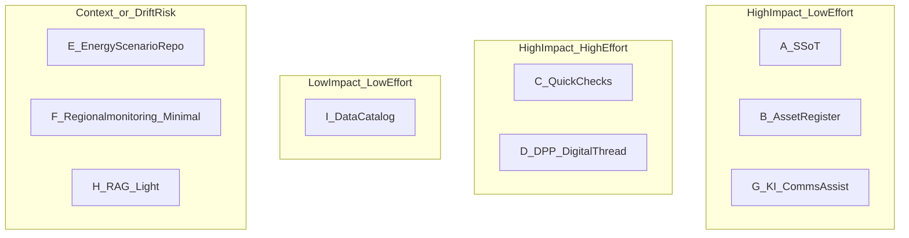

<!-- Reality Block
last_update: 2026-03-27
status: draft
scope:
  summary: "Optionen-Landkarte für WP 5.2 (ReST Data Platform): mehrere Richtungen, Vergleich, Shortlist-Logik fürs interne Brainstorming."
  in_scope:
    - options catalog
    - comparisons (effort/impact/maintenance/data readiness)
    - shortlist criteria for meeting
  out_of_scope:
    - binding commitments
    - detailed implementation
notes:
  - "Ziel: viele Optionen sichtbar machen, ohne Festlegung. Danach bewusst 1–2 Piloten auswählen."
-->

# Optionen-Landkarte (WP 5.2 – ReST Data Platform)

## Zweck (für das interne Meeting)
Wir wollen **nicht** sofort festlegen, *was* ReST wird, sondern **sinnvolle Richtungen vergleichbar machen** und am Ende **1–2 Piloten** auswählen, die in 6–12 Wochen etwas Sichtbares liefern.

Guardrail (bleibt gültig):
- **Standard statt Sonderanfertigung. Self‑Service statt Full‑Service. Prototyp statt Produktbetrieb.**

## Vergleichsdimensionen (damit Diskussion nicht zerfasert)
- **Impact**: bringt es in < 8–12 Wochen sichtbaren Nutzen?
- **Daten-Realismus**: sind Daten/Partnerzugang in der Zeit realistisch?
- **Maintenance**: entsteht laufender Betrieb/KPI‑Pflege/Support?
- **Stakeholder Pull**: wer „zieht“ wirklich daran (Partner/WPs/Leitung)?
- **Risiko**: Scope-Falle, Datenschutz, Datenqualität, Erwartungsmanagement.

## Ergänzung: Plattform-Add-ons (KI/Protokolle, optional)
Diese Add-ons sind **übergreifend** zu den Optionen A–I gedacht. Sie erhöhen die Zukunftsfähigkeit,
ohne den MVP zu überfrachten. **Nur aktivieren, wenn Aufwand/Nutzen passt.**

1) **KI‑Assist (RAG light / Drafts)**
- Fokus: Dokumenten‑Q&A mit Quellen oder Status‑Drafts.
- Risiko: Erwartungsmanagement, Datenklassifizierung.

2) **MCP‑Interface (Tooling‑Anbindung light)**
- Fokus: standardisierte Tool‑Aufrufe (z. B. Upload, Query, Report) für interne Agenten.
- Risiko: API‑Stabilität, Sicherheitsgrenzen.

3) **Gaia‑X / Interoperabilität light (DCAT‑AP)**
- Fokus: Metadaten‑Katalog/Exports, keine schweren Dataspace‑Connectoren.
- Risiko: Overhead ohne klaren Daten‑Pull.

4) **Agentic Framework (intern, z. B. AG2)**
- Fokus: interne Automationen/Workflows, keine „Autopilot“‑Versprechen.
- Risiko: Betrieb/Qualität/Monitoring.

## 9 Archetypen (Optionen A–I)
> Hinweis: Bewertung ist absichtlich grob und diskutierbar. Ziel ist ein gemeinsames Bild, keine „Wahrheit“.

| ID | Archetyp | Kurzbeschreibung | Typischer Nutzer | Datenbasis | Aufwand | Maintenance | Extern nutzbar | Haupt-Risiko |
|---:|---|---|---|---|---|---|---|---|
| A | **SSoT / Projekt-Datenhub** | Portal für Upload/Metadaten/Versionen/Exports („Ort der Wahrheit“) | intern + Partner | Upload‑first (CSV/XLSX/PDF) | niedrig | niedrig | optional | wirkt „zu wenig KI/Show“ |
| B | **WP2.1 Asset-/Anlagenregister** | Karte/Inventar „was ist wo“ + Quellen/Stand/Abdeckung | Partner + Öffentlichkeit (selektiv) | öffentlich + Partnerwissen | mittel | mittel | ja | Datenlücken/Uneinigkeit über „vollständig“ |
| C | **Quick‑Checks (Logistik)** | Firmendaten rein → Report/Empfehlungen raus (Modalshift/Elektrifizierung) | Unternehmen | sensibel, firmenspezifisch | mittel–hoch | hoch | ja | Service‑Falle / Individualwünsche |
| D | **DPP/Digital Thread light** | Objektmodell (Asset→Komponente→Material→Docs) als DPP‑Vorstufe | Industrie/Partner | partnergetrieben | hoch | hoch | ja | zu groß für 1 FTE, Standard-/Integrationslast |
| E | **Energie-/Szenario‑Repo** | Versionierte Modellläufe/Parameter/Outputs + reproduzierbare Reports | Forschung + Kommune | Modelloutputs | mittel | mittel | selektiv | Nutzen schwerer „zu verkaufen“ |
| F | **Regionalmonitoring minimal** | 10–30 Basisindikatoren als Kontext (nicht 150) | Öffentlichkeit + Leitung | Statistik-Quellen | mittel | mittel | ja | driftet zurück zur KPI‑Pflege |
| G | **KI‑Assist Kommunikation** | Statusupdates/Briefings/Meilenstein‑Zusammenfassungen | intern | Texte/Docs | niedrig | niedrig–mittel | nein | „nur intern“, Akzeptanz/Qualität |
| H | **RAG light (Dokumenten‑Q&A)** | Fragen zu Docs → Antwort **mit Quellen** | intern + Partner | Dokumente | mittel | mittel | selektiv | Erwartungsmanagement („ChatGPT kann alles“) |
| I | **Datenkatalog (DCAT light)** | „Welche Daten gibt es?“ Ownership/Stand/Update‑Rhythmus | intern + Partner | Metadaten | niedrig | niedrig | optional | alleine zu „katalogig“ |

## 2×2 Visual (Wirkung vs Aufwand) – Diskussionsstart

## Shortlist-Mechanik (10 Minuten im Meeting)
1) Jede Person wählt **max. 2 Favoriten** (A–I) – Bauchgefühl ok.
2) Für die Top‑4: kurzes „Reality Check“:
   - Daten in 6–12 Wochen realistisch?
   - Extern ja/nein? (und welche *eine* definierte Außenansicht)
   - Maintenance tragbar mit 1 FTE?
3) Ergebnis: **2 Piloten** auswählen:
   - **Pilot 1 (extern sichtbar)**: B oder C oder F (klein) – je nach Datenrealismus.
   - **Pilot 2 (Fundament/Intern)**: A oder I (ggf. plus H als Add‑on).

## Empfehlung als Entscheidungsprinzip (ohne Festlegung)
- **Aktueller Favorit (WP 2.1)**: **B** als Pilot (Offshore‑Asset‑Register) + **H** als Add‑on (RAG light), falls Datenlage/Compliance passt.
- Wenn **Datenlage unsicher**: starte mit **A/I** (SSoT/Katalog) und baue B/C darauf auf, sobald Daten sauber fließen.
- Wenn **Partner-Pull stark** und Daten verfügbar: starte mit **B** (Asset Register) als „Showcase“, aber halte die Scope‑Grenzen strikt.

