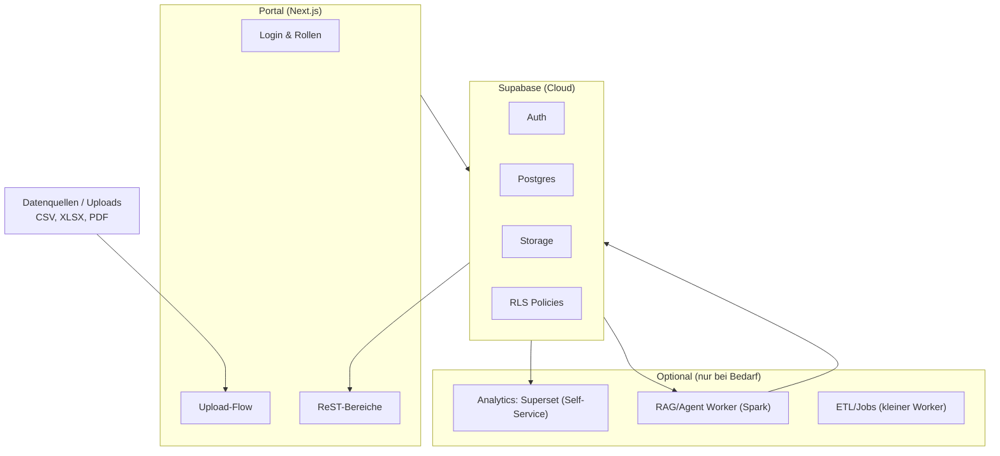

<!-- Reality Block
last_update: 2026-02-02
status: draft
scope:
  summary: "Slide-Gerüst für internes Meeting zur ReST Data Platform (schlank, überzeugend)."
  in_scope:
    - slide structure
    - talking points
    - stack diagram (mermaid)
  out_of_scope:
    - detailed implementation
notes: []
-->

# Slide-Outline (6–7 Slides)

## Slide 1 – Zielbild (1 Satz)
**Titel:** ReST Data Platform als schlanker Backbone  
**Kernaussage:** Ordnung + Nachvollziehbarkeit + Reporting, optional KI – **ohne Service‑Falle**.  
**1 Satz:** „Wir bauen den stabilen Backbone für Daten/Dokumente und halten KI bewusst optional.“

---

## Slide 2 – Guardrails (Scope Shield)
**Titel:** Was wir bewusst NICHT tun  
- Standard statt Sonderanfertigung  
- Self‑Service statt Full‑Service  
- Prototyp statt Produktbetrieb  
- Keine WP‑Sonderportale, keine Individual‑Dashboards, keine Spezial‑ETLs

---

## Slide 3 – Stack‑Architektur (Backbone + optional)
**Titel:** Plattform‑Stack (Front‑/Backend + optionale Dienste)  
**Bullets (detailierter, „klingt groß“):**
- **Frontend (Next.js‑App)**: Routing/Layouts, Auth‑Screens, Rollen‑UI, Upload‑Wizard, ReST‑Bereiche, Audit‑Views  
- **App‑Layer**: API‑Routes/Server‑Actions, Validierung, Business‑Logik, Zugriffskontrolle  
- **Supabase‑Layer**: Auth, Postgres, Storage, RLS‑Policies, (optional) Edge Functions/Realtime  
- **Betrieb/Themen, die beherrscht werden muessen**: Rechte‑Modelle, Datenmodelle, Migrationen, Backup/Restore, Observability  
- **Analytics (Superset, separat)**: eigener Dienst, liest read‑only aus Supabase/Postgres  
- **Optional**: Spark‑Worker (RAG/Embeddings), MCP‑Interface, Agent‑Framework (AG2)  

**Diagramm (Mermaid):**

**Sprechtext (kurz):**  
„Frontend ist das Portal mit Rollen, Upload‑Wizard und Audit‑Sichten. Backend ist die API‑/Daten‑Schicht mit Policy‑Enforcement und Storage‑Pipelines. Add‑ons hängen entkoppelt dran und schreiben nur Ergebnisse zurück.“

---

## Slide 4 – Optionen (Shortlist)
**Titel:** 2 Piloten statt 9 Baustellen  
**Empfohlene Shortlist:**  
- **A: SSoT / Datenhub** (niedriger Aufwand, hoher Nutzen)  
- **I: Datenkatalog light** (Ownership + Update‑Rhythmus)  
- **H: RAG light** (nur, wenn Datenlage/Compliance passt)

**Ziel:** 1–2 Piloten mit **sichtbarem Nutzen in 6–12 Wochen**.

---

## Slide 5 – MVP‑Slice (6–8 Wochen)
**Titel:** Minimum Useful Product  
1) Upload (CSV/XLSX/PDF)  
2) Metadaten + Versionierung  
3) 1 Report/KPI‑View  
4) Rollen/RLS minimal  

**Erfolgskriterium:** 1–2 Nutzer arbeiten ohne dich.

---

## Slide 6 – Entscheidungen morgen
**Titel:** Was wir klären müssen  
1) Pilotdomäne (welche Daten zuerst?)  
2) Datenzugriff & Ownership (wer darf was?)  
3) Optionales Add‑on (KI‑Assist, MCP‑Interface, Gaia‑X light)

---

## Slide 7 (optional) – Add‑ons & Öffnung
**Titel:** Optional, nicht verpflichtend  
- **KI‑Assist:** RAG light / Status‑Drafts  
- **MCP‑Interface:** standardisierte Tool‑Aufrufe  
- **Gaia‑X light:** DCAT‑AP Metadatenexport  
- **Agentic Framework:** intern, kein Autopilot‑Versprechen

---

# Miro-Board Blueprint (wenn kollaborativ)
**Frames (1:1 zu Slides):**
1) Zielbild  
2) Guardrails  
3) Stack‑Diagramm  
4) Optionen‑Shortlist  
5) MVP‑Slice  
6) Entscheidungen  
7) Add‑ons (optional)

**Tipp:** Von Scratch starten, damit es **schlank** bleibt. Template nur nutzen, wenn es bereits exakt eure Slide‑Logik abbildet.
